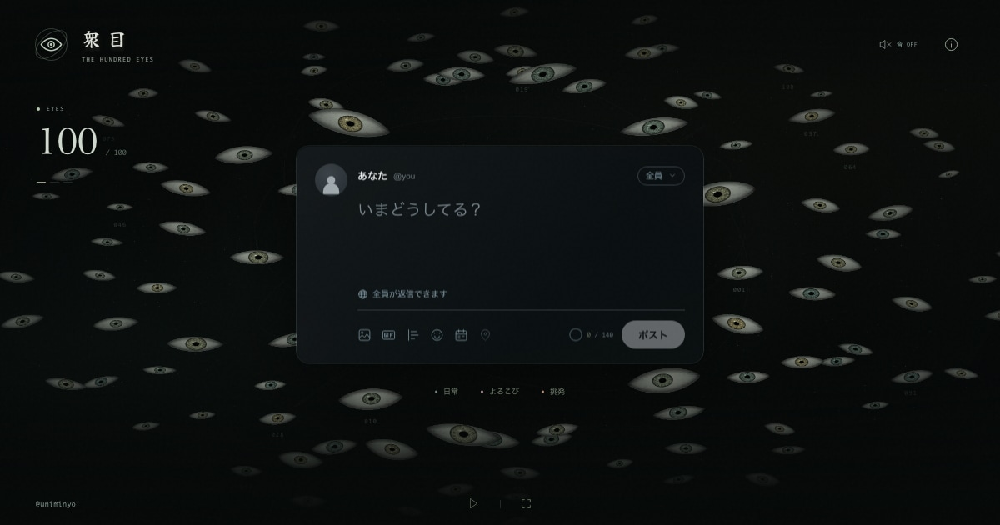

# THE HUNDRED EYES / 衆目

One post, a hundred readings. An interactive media artwork about the difference between what reaches people and what becomes audible.

**[Experience the artwork → eyes.mintan.org](https://eyes.mintan.org)**

By [@uniminyo](https://x.com/uniminyo) · [日本語](./README.md) · [MIT License](./LICENSE)

[](https://eyes.mintan.org)

An open-source [Jev / TypeSafe](https://docs.typesafe.ai/introduction) use case: typed Choice and Score results become gaze, light and amplified thoughts in a 3D artwork. Built with Next.js, React, Three.js and Web Audio. [Project summary and implementation links](./docs/JEV-USE-CASE.md)

## The experience

Posting sends one wave of blinks outward from the words. The eyes stay where they are. The same four people have an amplified platform on every post; their readings appear first even if their desire to speak is low. Everyone else remains faintly present.

Opening post analytics illuminates the same hundred eyes and shows their reaction counts. There is no prescribed indifferent majority. The archive expands each person in place, with a matching eye portrait and four emotional dimensions.

Rewriting reaches the same people again. Analytics show changes from the preceding post. Nothing is evaluated while typing; identical words reuse their result within the session. After a pause, the visitor's words and revisions remain, followed by “その言葉は、誰のために。” — Who are those words for?

- **判定基準** in artwork information exposes the criteria actually passed to Jev. The explanation and API use shared definitions.
- **Xでポスト** opens X's composer with the current words, a compact reaction breakdown and the artwork URL. Long share copies are shortened to fit X's weighted 280-character limit without altering the words in the artwork. The visitor confirms publication on X.
- Individual readouts fit without scrolling; the hundred-person archive remains scrollable.
- Mobile, reduced motion and a lightweight WebGL fallback are supported. Sound starts off; the **音 OFF** button enables the ambient audio.

## Run locally

```sh
npm ci
npm run dev -- --port 3001
```

Open `http://localhost:3001`. Without a key, a clearly disclosed local rule-based sketch is used. To enable Jev, create a Git-ignored `.env.local`:

```dotenv
TYPESAFE_API_KEY=your_key_here
JEV_MODEL=jev-latest
```

Never expose the key through a `NEXT_PUBLIC_` variable. See [.env.example](./.env.example).

## Model and authorship

Each person receives one Choice and four independent Scores: interest, affection, discomfort and desire to speak. The 500 questions are sent in four parallel requests of 25 people. Only a complete, validated response updates the room; failures preserve the previous observation.

Persona definitions, short thoughts and reach are authored. Jev does not generate the displayed prose. Reaction counts emerge from the readings, and confidence is not used as emotional intensity. These are fictional observers, not measured people or X analytics.

The amplified cast has four distinct dispositions: suspicion, ironic distance, devotion, and sensitivity to harsh words. Their platform remains fixed while their model-derived reactions change. Analytics then count every observer equally.

Blink timing is artistic choreography, not Jev execution telemetry. Only explicitly posted text is sent to TypeSafe.

## Validate and deploy

```sh
npm run lint
npm run build
npm run test:e2e
```

Automated checks use local or synthetic responses; they do not send live posts to Jev or X. Install test browsers with `npx playwright install` if needed.

- [Current implementation, previews and live connection records (Japanese)](./docs/ATTENTION-EXPERIENCE.md)
- [Vercel deployment instructions (Japanese)](./docs/DEPLOYMENT.md)
- [Contributing](./CONTRIBUTING.md)

Earlier design records remain in `docs` and Git history. Historical descriptions of fixed counts or evaluation while typing do not describe this build.

## License

Code, original project documentation and artwork screenshots are available under the [MIT License](./LICENSE). Fonts and dependencies retain their own licenses; see [third-party notices](./THIRD_PARTY_NOTICES.md).

The Jev model and API are not part of this repository. Bring your own TypeSafe key to use the API. This is an independent artwork, not a claim of official TypeSafe authorship, endorsement or showcase acceptance.
